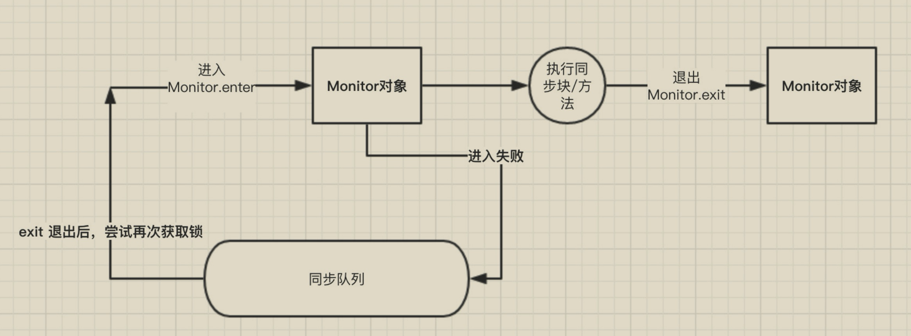
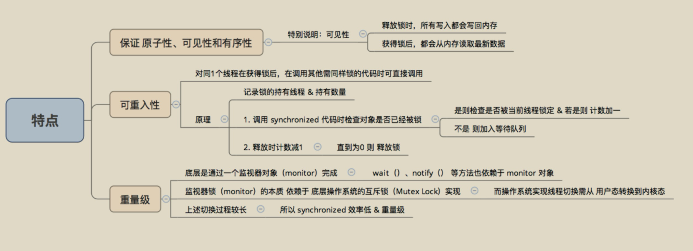

# synchronized
#2. 并发/synchronized#
[Synchronized 关键字原理 - 钱立清的博客 - CSDN博客](https://blog.csdn.net/weixin_36759405/article/details/83034386)
- - - -
## 作用
* 修饰**代码块**，即同步语句块，其作用的范围是大括号{}括起来的代码，作用的对象是调用这个代码块的对象。
* 修饰**普通方法**，即同步方法，其作用的范围是整个方法，作用的对象是调用这个方法的对象。
* 修饰**静态方法**，其作用的范围是整个静态方法，作用的对象是这个类的所有对象。
- - - -
## 原理
[Java对象头](bear://x-callback-url/open-note?id=1DCE5988-84F5-479E-B588-5B71047FBD0B-679-00001A2C0F5EB380)
JVM 是通过进入、退出::对象监视器(Monitor)::来实现对方法、同步块的同步的，而对象监视器的本质依赖于底层操作系统的**互斥锁(Mutex Lock)**实现。
具体实现是在编译之后在同步方法调用前加入一个monitor.enter指令，在退出方法和异常处插入monitor.exit的指令。
对于没有获取到锁的线程将会阻塞到方法入口处，直到获取锁的线程monitor.exit之后才能尝试继续获取锁。
流程图如下：

在synchronized修饰方法时是添加ACC_SYNCHRONIZED标识，该标识指明了该方法是一个同步方法，JVM通过该ACC_SYNCHRONIZED访问标志来辨别一个方法是否声明为同步方法，从而执行相应的同步调用。
synchronized 属于::重量级锁::，效率低下，因为监视器锁（monitor）是依赖于底层操作系统的 Mutex Lock 来实现的，而 _操作系统实现线程之间的切换时需要从用户态转换到核心态_ ，这个状态之间的转换需要相对比较长的时间，时间成本相对较高，这也是为什么早期的 synchronized 效率低的原因。庆幸的是在 Java 6 之后 Java 官方从 JVM 层面对 synchronized 进行了较大优化，所以现在的 synchronized 锁效率也优化得很不错了。Java6之后，为了减少获得锁和释放锁所带来的性能消耗，引入了轻量级锁和偏向锁，
- - - -
## 特点
